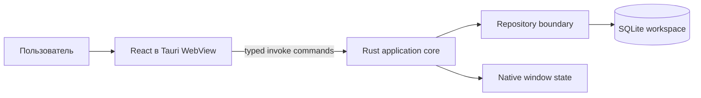

<div align="center">
  
  <h1>Noir Note</h1>
  <p><strong>Минималистичное local-first пространство для заметок и структурированных документов.</strong></p>
  <p>Tauri desktop · React · TypeScript · Rust · SQLite</p>

  <p>
    <a href="https://github.com/minkinad/noir-note/actions/workflows/ci.yml"></a>
    <a href="https://github.com/minkinad/noir-note/actions/workflows/windows-build.yml"></a>
    
    
    <a href="LICENSE"></a>
  </p>

  <p>
    <a href="#quick-start">Быстрый старт</a> ·
    <a href="#features">Возможности</a> ·
    <a href="#architecture">Архитектура</a> ·
    <a href="#data-and-privacy">Данные</a> ·
    <a href="#quality">Качество</a> ·
    <a href="docs/README.md">Документация</a>
  </p>
</div>

---

Noir Note — нативное desktop-приложение для спокойной работы с личными знаниями. Оно объединяет
иерархию страниц, блочный редактор, быстрый локальный поиск и SQLite-хранилище в компактной оболочке
без аккаунта, облачного сервиса и обязательного подключения к сети.

> **Статус:** активная разработка (`0.1.x`). Основной сценарий уже работает, однако форматы данных и
> UX могут меняться. До появления встроенного экспорта регулярно создавайте резервную копию файла
> workspace. Синхронизация между устройствами и шифрование at rest пока не реализованы.

<a id="features"></a>

## Возможности

| Область | Что реализовано |
| --- | --- |
| Документы | Вложенные страницы, переименование, удаление поддерева и список недавних страниц |
| Редактор | Text, heading, to-do, list, quote, code и divider blocks |
| Навигация | Поиск по заголовку, пути и содержимому; keyboard-first команды |
| Редактирование | Slash menu, drag-and-drop, undo/redo и перемещение с клавиатуры |
| Сохранение | Debounced autosave с сериализацией записей и моделью latest-write-wins |
| Хранилище | Локальная SQLite, WAL, foreign keys и последовательные schema migrations |
| Desktop | Кастомный title bar, восстановление размера/позиции окна, Windows NSIS и MSI bundles |

### Горячие клавиши

| Комбинация | Действие |
| --- | --- |
| `Ctrl/Cmd + K` | Перейти к поиску |
| `Ctrl/Cmd + N` | Создать страницу рядом с текущей |
| `Ctrl/Cmd + Z` | Отменить изменение |
| `Ctrl/Cmd + Shift + Z` | Повторить изменение |
| `/` | Открыть каталог блоков |
| `Alt/Cmd + ↑/↓` | Переместить блок |
| `Ctrl/Cmd + Enter` | Выйти из code block в новый блок |

<a id="architecture"></a>

## Архитектура



Проект разделён на UI и desktop core. React отвечает за представление, локальную editor history и
оркестрацию autosave. Tauri-команды образуют узкую границу между TypeScript и Rust. Rust проверяет
состояние, выполняет транзакции и остаётся единственным владельцем SQLite.

```text
noir-note/
├── src/
│   ├── components/         React UI и block editor
│   ├── hooks/              Workspace orchestration и desktop hooks
│   ├── services/           Pure state, search, history и persistence queue
│   ├── types/              Общий frontend domain contract
│   └── utils/              Block helpers
├── src-tauri/
│   ├── migrations/         Append-only SQLite migrations
│   └── src/                Tauri commands и repository layer
├── tests/                  Node-based unit tests
└── docs/                   Architecture, ADR и operations guide
```

Подробности: [Architecture](docs/ARCHITECTURE.md) · [ADR](docs/adr/README.md) ·
[Operations runbook](docs/operations/runbook.md).

<a id="quick-start"></a>

## Быстрый старт

### Требования

- Node.js 22 и npm;
- Rust stable toolchain;
- [системные зависимости Tauri 2](https://v2.tauri.app/start/prerequisites/) для вашей ОС.

```bash
git clone https://github.com/minkinad/noir-note.git
cd noir-note
npm ci
npm run tauri:dev
```

Для разработки только frontend можно запустить `npm run dev`, но операции с workspace требуют
Tauri runtime и не работают как самостоятельное web-приложение.

### Linux (Debian/Ubuntu)

```bash
sudo apt-get update
sudo apt-get install -y \
  pkg-config \
  libgtk-3-dev \
  libwebkit2gtk-4.1-dev \
  librsvg2-dev \
  patchelf
```

### Основные команды

```bash
npm run tauri:dev       # desktop development
npm run check           # typecheck, unit tests, frontend production build
npm run tauri:build     # native bundle for the current platform

cargo fmt --manifest-path src-tauri/Cargo.toml --check
cargo check --manifest-path src-tauri/Cargo.toml
```

Инструкции по окружению и устройству тестов находятся в
[Development guide](docs/DEVELOPMENT.md).

<a id="data-and-privacy"></a>

## Данные и приватность

- Заметки хранятся только в `workspace.sqlite3` внутри platform-specific app data directory.
- Приложение не требует аккаунта и не отправляет содержимое в удалённый сервис.
- База не зашифрована: защита устройства, учётной записи ОС и диска остаётся ответственностью
  пользователя.
- Удаление страницы каскадно удаляет вложенные страницы и их блоки.
- Перед обновлением и при важных изменениях рекомендуется закрыть приложение и скопировать каталог
  `data` целиком.

Пошаговые backup/restore и диагностика описаны в
[operations runbook](docs/operations/runbook.md). О найденных уязвимостях сообщайте по инструкции из
[SECURITY.md](SECURITY.md), а не через публичный issue.

<a id="quality"></a>

## Quality gates

На каждый push в `main` и pull request CI выполняет:

- strict TypeScript typecheck;
- unit tests для block helpers, editor history, page tree, workspace state и persistence queue;
- production frontend build;
- `cargo fmt --check` и `cargo check`;
- сборку Windows NSIS bundle в отдельном workflow.

Release workflow создаёт draft GitHub Release и собирает NSIS/MSI installers для тегов `v*`.
Публичный production-релиз дополнительно требует code signing, smoke test и проверку backup/restore;
см. [release checklist](docs/operations/runbook.md#release-checklist).

## Ограничения и roadmap

Сейчас Noir Note — single-device приложение. Ещё не реализованы:

- Markdown/PDF export и импорт;
- синхронизация, аккаунты и совместное редактирование;
- шифрование workspace на уровне приложения;
- структурное drag-and-drop для дерева страниц;
- подписанные installers и автообновление;
- plugin/command API.

Эти пункты — направление развития, а не обещание совместимости или сроков.

## Поддержка проекта

- Ошибка или feature request: используйте [GitHub Issues](https://github.com/minkinad/noir-note/issues)
  и подходящий шаблон.
- Вопрос по запуску или восстановлению данных: сначала проверьте [SUPPORT.md](SUPPORT.md).
- Уязвимость: следуйте [SECURITY.md](SECURITY.md).
- Нормы общения: [CODE_OF_CONDUCT.md](CODE_OF_CONDUCT.md).

## Лицензия

Исходный код распространяется по лицензии [MIT](LICENSE).
