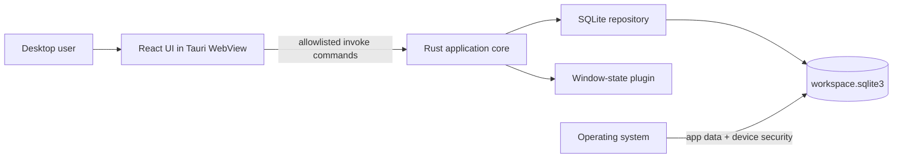

# Architecture

## 1. Purpose and priorities

Noir Note is a local-first desktop knowledge workspace. The architecture optimizes, in order, for:

1. durable local writes and recoverability;
2. user privacy and an intentionally small trust boundary;
3. responsive keyboard-first editing;
4. testable state transitions and explicit component ownership;
5. cross-platform packaging;
6. future evolution without implying a sync protocol today.

## 2. System context

There is no application server or account service. The operating-system user account and app data
directory define the current security perimeter.

## 3. Component ownership

| Component | Responsibility | State it owns |
| --- | --- | --- |
| React components | Rendering, focus, drag/drop, user intent | Ephemeral view state |
| `useWorkspace` | Bootstrap, commands, active page, autosave orchestration | Reducer and persistence queue |
| Pure services | Tree/search, editor history, reducer, write ordering | Immutable in-memory snapshots |
| Tauri API wrapper | Typed TypeScript command contract | No durable state |
| Rust command layer | Narrow IPC boundary and error translation | Managed `Database` handle |
| Repository | Validation, transactions, queries, seed data | SQLite records and settings |
| Migrations | Ordered schema evolution | `_migrations` version history |

UI modules must not reach around the Tauri API wrapper. Durable invariants belong in Rust because
frontend state is replaceable and command input is not trusted merely because it came from the
bundled WebView.

## 4. Core flows

### Startup

1. Tauri resolves the platform app-data directory and creates its `data` child.
2. The repository opens `workspace.sqlite3`, enables WAL, foreign keys, and normal synchronous mode.
3. Pending migrations run sequentially; an empty database receives the initial workspace.
4. React invokes `bootstrap_workspace` and normalizes pages, blocks, recent pages, and active page
   into reducer state.
5. The window-state plugin restores native window placement independently.

Startup fails visibly rather than silently replacing or resetting an unreadable database.

### Editing and autosave

1. A component emits the complete next block list or page title.
2. The reducer applies the change immediately and records editor history when appropriate.
3. A keyed queue copies and debounces the payload.
4. Writes for a key are serialized. If an edit arrives during an in-flight write, the latest pending
   payload is written next.
5. Rust replaces the page's blocks inside one transaction and updates the page timestamp.

Title and block writes share one queue-level health signal, so the UI reports `saved` only when all
pending workspace writes have settled successfully.

### Delete

The UI computes the affected subtree for navigation and cancels its pending writes. SQLite foreign
keys cascade the durable delete from a page to descendants and blocks. The database remains the
authority; frontend cleanup follows a successful command.

## 5. Data model

| Table | Purpose | Important invariant |
| --- | --- | --- |
| `pages` | Ordered adjacency-list page tree | `parent_id` cascades on delete |
| `blocks` | Ordered typed content for a page | `page_id` is required and cascades |
| `settings` | Active page and recent-page navigation | Values are application-owned JSON/text |
| `_migrations` | Applied schema versions | Versions are monotonic |

SQLite is the single source of truth. Migrations are append-only after release and execute under an
immediate transaction. Backups must be treated as a set containing the main database and any WAL/SHM
companions unless the application has been cleanly closed.

## 6. Trust and privacy boundary

- Tauri capabilities expose only required window operations.
- IPC commands are registered explicitly; adding a command expands the attack surface.
- The app currently performs no content network requests and has no telemetry path.
- SQLite content is plaintext. OS permissions and full-disk encryption protect data at rest.
- Local compromise, malicious software in the same account, and hostile imported content are not
  currently mitigated by application-level encryption or process isolation.

See [SECURITY.md](../SECURITY.md) for supported security claims.

## 7. Delivery model

Vite produces the frontend assets and Cargo builds the native application. Tauri bundles the result
for the current platform. CI verifies Linux compilation and frontend behavior; a separate Windows
job produces an NSIS artifact. Tagged release automation produces draft NSIS and MSI assets.

Artifact signing, notarization, auto-update metadata, and reproducible-build attestations are not yet
configured and remain release risks.

## 8. Evolution rules

- Add import/export behind an application service; never couple format parsing to UI components.
- Design sync as an explicit protocol with stable IDs, conflict semantics, encryption decisions, and
  migration compatibility before adding a remote transport.
- Introduce plugins only with scoped capabilities and a documented trust model.
- Split the repository layer when a domain has distinct invariants, not merely to reduce file size.
- Prefer forward-compatible migrations and explicit recovery instructions.

## 9. Known risks

- Application-level encryption and secure deletion are not implemented.
- Backup and restore are manual and have no in-app verification.
- SQLite repository integration tests are not yet part of the automated suite.
- IPC block types and payload sizes need stronger Rust-side validation before accepting imported or
  third-party content.
- Linux/macOS release packaging is not exercised by dedicated artifact workflows.
- Release artifacts are not signed and no auto-updater is configured.

These are explicit limitations, not production guarantees hidden behind the local-first label.
